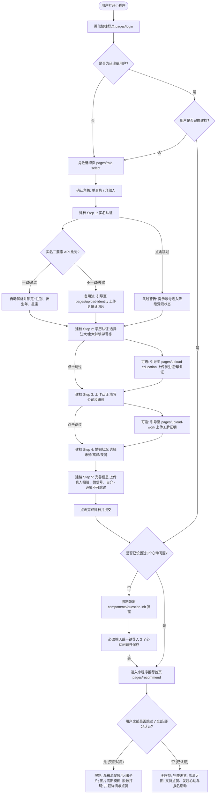
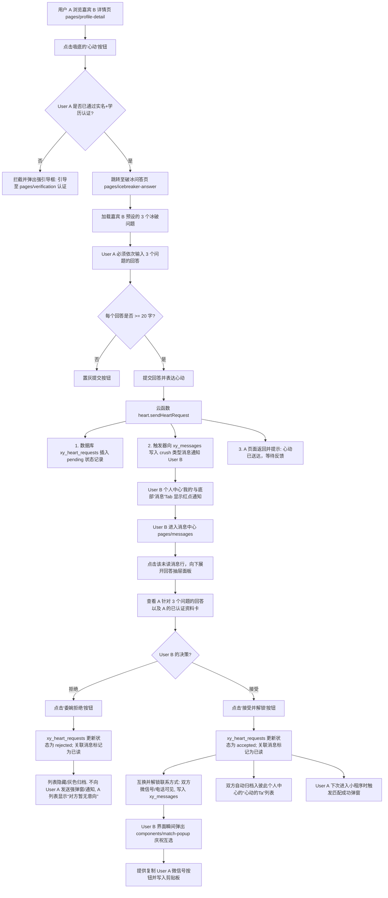
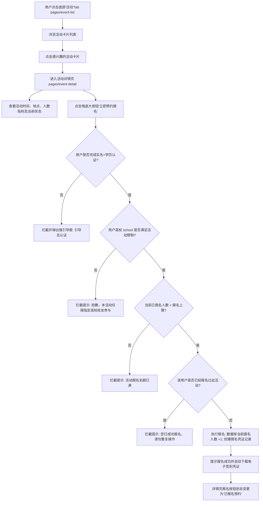
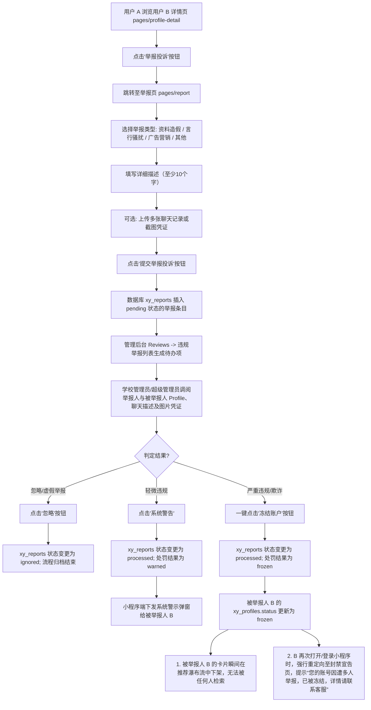
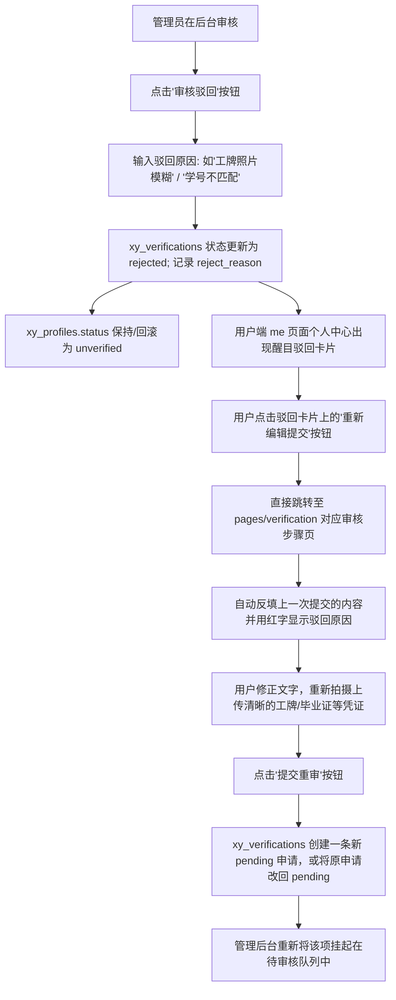
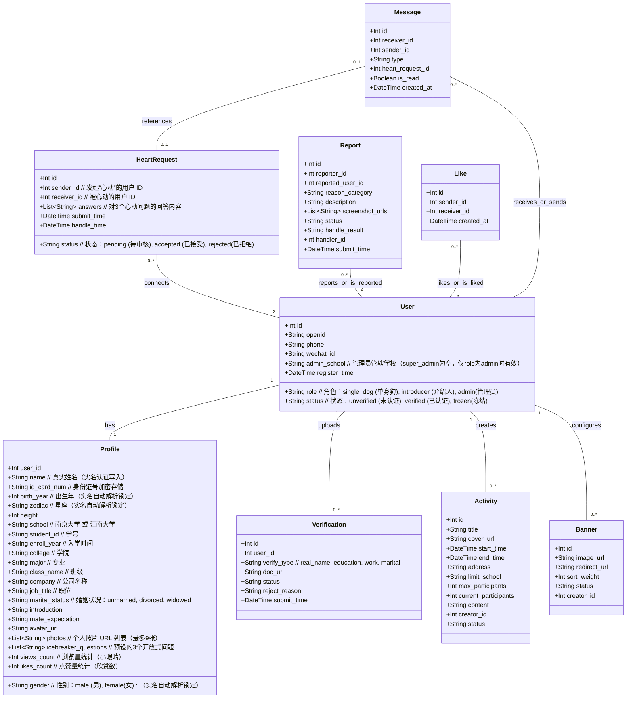

# “校缘”高校校友相亲小程序产品需求文档（一期MVP版）

## 0. 定位与一期MVP决策摘要

### 0.1 试点背景与产品定位
本产品命名为“**校缘**”，定位为“**面向高校校友与单身青年的高信任圈层相亲小程序**”。首个落地试点确定为“**南京大学**”与“**江南大学**”的校友及在校生圈层。
平台通过真实的身份认证与角色分工，构建高信任度、严肃真实的闭环相亲平台。

### 0.2 一期MVP业务决策矩阵

| 业务维度 | MVP设计决策与规约 |
| --- | --- |
| **产品名称** | **校缘** |
| **一期功能范围** | **注册、多角色认证、Banner与圆角暖色瀑布流浏览、心动问答申请与审核匹配**。 |
| **用户角色划分** | 注册后分为三个角色：**单身狗**、**介绍人**、**管理员**。 |
| **快捷登录与认证** | **微信手机号快捷登录**。选择角色后必须完成五步注册建档流程：**1. 实名 -> 2. 学历 -> 3. 工作 -> 4. 婚姻状况 -> 5. 完善信息**。首次完成注册后登录，系统引导设置 **3个心动问题（Icebreaker Questions）**。 |
| **首页展现与布局** | **圆角暖色卡片瀑布流展示**，顶部带有 **Banner 轮播图**（介绍产品或活动）。整体设计体现亲和力，卡片到详情跳转支持**共享元素放大过渡动效**。 |
| **跳过认证限制** | 允许用户跳过认证，但受限状态为：**瀑布流下拉至第 4 个卡片后截断，后续卡片高斯模糊打码，且无法点击查看详情或发起‘心动’，点击拦截并弹出引导框，引导用户去完成认证。** |
| **实名认证方案** | **公安身份证二要素核验 API（自动核验）**：输入真实姓名与身份证号，调用第三方核验 API 进行实时核查。**成功后系统自动解析并锁定性别、出生年与星座，防止篡改**。 |
| **学历认证字段** | 选择学校（**仅限“江南大学”与“南京大学”**），并输入：**学号、入学时间、学院、专业、班级**。 |
| **统计与热度指标** | 用户卡片和详情页只显示**“浏览量（小眼睛）”与“点赞量（欣赏数）”**。为免人被视作“商品”，相亲更不提倡1对多，不设置“收藏”功能，以保持严肃温暖的定位。 |
| **匹配/解锁规则** | **心动问答双向审核机制**。A 对 B 点击“心动”后，必须回答 B 预设的 3 个心动问题。B 在个人中心收到回答后，选择“接受”或“拒绝”。若**接受**，则双方解锁微信及联系方式，对方归入个人中心的“心动的Ta”列表。 |
| **底部导航 (TabBar)** | 底部 TabBar 采用 4-Tab 布局，统一顺序为：**1. 推荐、2. 活动、3. 消息、4. 我的**。各页面需准确高亮激活态。 |
| **消息通知中心** | 消息分为**点赞消息**（仅提示“X 欣赏了你”，支持一键批量已读，无需二级详情）与**心动消息**（点击跳转并展开问题回答详情以执行审批）。 |


---

## 1. 问题陈述

适龄单身青年有扩大相亲圈子的刚需，但普通婚恋应用和陌生人社交平台陌生人属性极强，用户极度担心资料造假、婚恋状态隐瞒、照片失真、骗钱骗色以及低质量打扰。
为了解决高信任相亲的需求，“校缘”要求用户选择明确的身份角色，并执行严格的认证与建档流程。同时为了解决冷启动时用户的流失率，平台支持“跳过认证”作为试用模式，但首页瀑布流将在展示4个卡片后截断并打码，引导未认证用户完成认证以解锁完整功能。另外，为了避免快餐式社交无脑“喜欢”带来的低诚意打扰，平台引入了“心动问答”机制，通过3个严肃心动问题的回答与双向确认，过滤低意向用户，提升匹配的诚意度与成功率。

---

## 2. 产品愿景

打造一个面向江南大学和南京大学等高校校友及单身青年的高信任圈层相亲小程序。以多角色架构分类运营，以二要素实名、学籍、工作进行认证，并以温暖亲和的圆角卡片和暖色调进行视觉设计，以 Banner 和瀑布流促成高效率浏览，并以 3 个心动问答和单向接受机制控制打扰，打造纯净、严肃、高品质且有温度的校友相亲基础设施。

## 3. 功能规划与核心机制

### 3.1 核心目标（一期 MVP 范围）
1. 提供微信手机号快捷登录与账号注册机制。
2. 新增多角色注册认证引导：单身狗（主相亲）、介绍人（推荐红娘）及管理员三种身份选择。
3. 建立二要素实名核验与学籍认证机制，保障用户身份真实度。
4. 采用非强硬的五步注册建档，前四步支持“跳过”进入试用模式。
5. 实现未认证用户的“跳过试用”拦截机制（瀑布流至第 4 个卡片截断，图片高斯模糊，点击详情/心动即弹出引导框引导认证）。
6. 实现首页顶部 Banner 轮播，以及嘉宾卡片的暖色调圆角瀑布流展示与共享元素放大跳转动效。
7. 提供去商品化的低热度指标，支持卡片与详情页展示“浏览量（小眼睛）”与“点赞（欣赏）量”，递增防刷。
8. 建立心动问答审核与解锁流程，支持回答心动问题、接受/拒绝审核，以及接受后解锁微信号/手机号并在“心动的Ta”中归档展示。

### 3.2 非目标（一期暂不实现）
1. 不做完全开放的陌生人广场。
2. 不做父母代办独立角色（一期仅限“单身狗”、“介绍人”和“管理员”）。
3. 不做线下活动模块。
4. 不内置即时通讯（IM）聊天功能。
5. 不做收费模式、会员特权与广告展示。

---

## 4. 目标用户与角色定义

### 4.1 单身狗 (主要相亲角色)
寻找对象的单身青年（主要为江南大学、南京大学的校友和在校学生）。核心诉求是浏览真实认证的对象，安全匹配。

### 4.2 介绍人 (红娘/推荐人角色)
热心红娘、校友会联络人或单身青年的朋友，旨在帮助身边的单身狗物色对象、进行撮合和信用背书（一期仅支持注册与基础建档）。

### 4.3 管理员
平台运营者，负责后台用户管理，查看并处理认证异常申请、封禁违规用户。（管理员暂时不开放用户选择，通过后台注入即可）

---

## 5. 功能需求明细

### 5.1 登录、角色选择与信息建档
1. **微信手机号快捷登录**：用户通过微信授权获取手机号，实现一键登录/注册，保证账号唯一性与联系方式的真实性。
2. **角色选择**：首次登录注册的用户必须选择其角色：
   * 单身狗
   * 介绍人
   * 管理员
3. **五步注册与信息建档流**：选择角色后，引导用户依次完成以下步骤。除前四步提供“跳过”按钮外，第五步为建档的收尾步骤。若用户选择跳过，账号将进入受限试用状态：
   * **第一步：实名认证**（仅填写姓名与身份证号，不包含学校信息，验证成功后系统自动解析并锁定性别、出生年与星座）。
   * **第二步：学历认证**（选择学校、填写学号、专业、入学年份（年级）。不需要上传证件/学历照片等资料）。
   * **第三步：工作认证（选填）**（填写工作单位/公司名称、职业/岗位，此步骤为选填，可留空，不需要上传资料）。
   * **第四步：婚姻状况认证**（选择婚姻状态）。
   * **第五步：完善个人资料**（填写微信号、可选填生日、星座、手机号。其中仅微信号为必填，其他全选填，不需要上传资料）。
4. **心动问题初始化引导**：用户在完成上述全部五步注册建档流程后，**首次进入小程序时，系统会强制弹出“设置心动问题”引导页/弹窗**。系统要求用户必须设置**恰好 3 个开放性心动问题**（作为后续他人向其发起“心动”时的破冰提问），用户提交确认后方能正式开始浏览。

### 5.2 认证与建档体系规约与核验方案

#### 5.2.1 实名认证（姓名+身份证号）
* **需求**：用户必须输入其真实姓名与 18 位身份证号码。
* **可用认证方案（API核验与数据自动解析）**：
  * **方案建议**：**集成第三方服务商（如腾讯云/阿里云云市场）的“身份证二要素实名核验 API”**。
  * **技术实现与数据自动解析**：
    1. 前端表单收集用户的 `姓名` 和 `身份证号`。
    2. 提交时，云函数向第三方核验 API 发起 HTTPS Post 请求，将姓名与身份证号作为参数传入。
    3. 第三方 API 对接全国公民身份信息系统，返回比对结果 JSON。
    4. 云函数解析返回码，若一致（`status: 0`），实名认证通过，系统后台自动执行以下解析并锁定：
       * **性别解析**：解析身份证号第 17 位数字（奇数为男，偶数为女）。系统在数据库中自动写入并锁定该字段，防止用户后续在前端篡改，从源头上杜绝性别欺诈。
       * **出生年份解析**：解析身份证号第 7-10 位（生日前 4 位），自动计算并锁定出生年份，以此生成年龄并在资料卡中展示。
       * **星座（Zodiac）解析**：解析身份证号第 11-14 位（月日信息，MMDD），根据日期区间自动计算出用户的星座（如：0321-0419 自动匹配并展示为“白羊座”），无需用户手动填写。
       * 锁定用户的真实姓名，防止后续篡改。
    5. 若不一致，拦截并提示用户重新输入。
  * **计费与成本**：单次核验计费约为 0.1~0.2 元，仅在用户提交时扣费，成本低且核验级别高。
  * **容错备用流**：若用户因生僻字、新身份证等导致 API 比对失败，系统提供“上传身份证照片申请人工复核”入口，由管理员后台人工审批。

#### 5.2.2 学历认证
> [!IMPORTANT]
> **目前支持高校以“江南大学”与“南京大学”等为主**。

* **必须填写字段**：
  * **学校名称**（如南京大学 / 江南大学）
  * **最高学历**（本科 / 硕士 / 博士）
  * **学号**
  * **专业**
  * **入学年份**（即年级）
* **核验说明**：本步骤仅通过文本表单收集学籍与学历的文本信息，不需要上传学生证、毕业证等实体资料。

#### 5.2.3 工作认证（选填）
* **选填字段**：
  * **公司名称**（选填）
  * **职业/岗位**（选填）
* **说明**：本步骤为选填项，供有工作的校友填写，在校生或不愿披露的用户可以直接点击“下一步”留空跳过，无需任何校验且不需要上传工作证明照片。

#### 5.2.4 婚姻状况认证
* **必须填写字段**：
  * **婚姻状况选择**（未婚、离异、丧偶）。

#### 5.2.5 完善个人资料
* **必须填写字段**：
  * **微信号 (WeChat ID)**：必填。作为双向确认匹配成功后解锁联系方式的核心媒介。
* **选填字段**：
  * **出生日期**：选填。支持日期选择器（若在实名步骤中填过身份证，则可根据身份证号自动解析预填，用户亦可手动选择，不填则不披露）。
  * **星座**：选填。支持下拉选择或根据生日自动计算。
  * **手机号**：选填。
* **说明**：此步骤不强制要求上传照片，也不需要上传其它材料证明。仅微信号是唯一必填字段。
* **自动填充并展示字段（选填辅助）**：
  * **星座/生日**：由第 1 步身份证解析出的生日 and 星座在此处自动展示，用户可预览确认。
  * **性别**：由第 1 步解析出的性别自动锁定并在此处展示。

---

### 5.3 跳过认证与受限状态限制

> [!WARNING]
> 若用户在注册认证流中点击了“跳过认证”，系统将允许其进入小程序，但实施严格的**降级受限策略**：

1. **瀑布流截断限制**：受限用户在首页瀑布流中**最多只能加载 4 个嘉宾卡片**。当下拉滚动到第 4 个卡片后瀑布流终止，第 4 个卡片下方展示强引导文案“立即完成认证以查看更多优秀嘉宾”。
2. **照片模糊限制**：所浏览的 4 个卡片的头像和主照片，全部在前端和后端进行高斯模糊处理（前端应用 `filter: blur(20px)`，且后端返回图片 URL 为缩略模糊图，从源头上保障隐私安全，防止技术性破解）。
3. **信息脱敏限制**：所有详细文字信息实施严格的脱敏打码。
   * 姓名显示为：`张*`
   * 学校显示为：`南*大学` 或 `江*大学`
   * 公司显示为：`某*公司`
   * 自我介绍等长文本全部隐藏，显示为“【认证后解锁完整信息】”。
4. **功能阻断拦截**：受限用户无法点击卡片进入详情页，也无法对任何人发起“点赞”或“心动”操作。尝试点击任何卡片、点赞或心动按钮时，系统自动拦截，弹出**“去完成认证”的强引导对话框**，点击直接跳转至 `/pages/verification/index`。

---

### 5.4 推荐与心动问答匹配逻辑

一期 MVP 的核心匹配模式采用 **“心动问答与双向审核机制”**，取消了低意向的左右无脑划卡模式。

#### 5.4.1 卡片瀑布流展示
* 首页以**卡片瀑布流**的形式展现嘉宾。系统结合用户的性别（默认展现异性）和择偶偏好在瀑布流中进行推荐展现。
* 整体风格为**大圆角卡片**，背景使用具有亲和力的**暖色调**设计（珊瑚粉、暖蜜橙等渐变配以轻量磨砂质感）。
* 用户在瀑布流中点击某张嘉宾卡片时，卡片通过**共享元素放大过渡动效 (Shared Element Transition)** 平滑展开跳转至该嘉宾的详情页，保证交互的流畅和高级感。

#### 5.4.2 统计指标（浏览与点赞量）
为防止人被当作商品进行“收藏”，系统去除了“收藏”功能，仅保留代表活跃与人气的软性数据：
1. **浏览量（小眼睛）**：
   * 嘉宾详情页每次被其他用户打开时，该嘉宾的浏览量自增 1。
   * **防刷机制**：云函数在 Redis 或数据库记录访问历史，同一访问用户在 10 分钟内重复访问同一嘉宾，浏览量不重复递增。
2. **点赞量（欣赏/同频数）**：
   * 详情页中提供“点赞（欣赏）”图标。用户无需回答心动问题，即可对心仪的嘉宾进行点赞。点赞作为轻量的赞赏表态，会在嘉宾的卡片和详情页上累加展示。
   * **限制规则**：每人每天对同一位嘉宾仅限点赞 1 次。

#### 5.4.3 心动问答与审核解锁流
用户若希望获取某嘉宾的联系方式，必须经历“心动问答”双向确认流程：
1. **发起心动**：用户 A 在嘉宾 B 的详情页点击底部的“心动”按钮，系统拦截并跳转至心动问答页（`/pages/icebreaker-answer/index`）。
2. **回答问题**：页面展出 B 预设的 3 个心动问题。A 必须完整回答这 3 个问题，填写完毕后提交，系统生成一条状态为 `pending`（待处理）的 `HeartRequest`（心动申请）记录。
3. **通知与查看**：B 的个人中心“心动申请（收到的回答）”出现红点提示。B 可点开查看 A 提交的 3 个问题回答内容，以及 A 的已认证资料（实名、学历、工作等）。
4. **审核操作**：B 对 A 的申请可执行两项操作：
   * **拒绝**：若 B 认为双方不合适或回答缺乏诚意，点击“拒绝”。申请状态变更为 `rejected`（已拒绝）。系统不向 A 发送明确的拒绝通知以保护双方自尊心，但 A 的申请列表中会更新为“对方暂无意向”。
   * **接受**：若 B 对 A 的回答和资料表示满意，点击“接受”。申请状态变更为 `accepted`（已接受）。
5. **解锁与归档**：
   * **联系方式解锁**：B 点击“接受”后，双方瞬间解锁对方的微信号和手机号。在详情页中，联系方式字段从“🔒 互选成功后自动解锁”变更为明文，并提供一键复制微信号和拨打电话的按钮。
   * **归档至心动的Ta**：A 和 B 互相同步加入对方个人中心的“心动的Ta”列表中，以便随时查找和联系对方。同时系统为双方弹出“匹配成功”即时弹窗，展示匹配成功效果。

#### 5.4.4 消息通知已读未读与触发机制
为了使用户能够及时了解互动状态，平台引入了“消息中心”机制。任何来自他人的积极互动均会触发系统消息：
1. **点赞消息触发**：当用户 A 浏览用户 B 的资料并执行“点赞（欣赏）”时，系统会在后台为 B 生成一条 `type = 'like'` 的未读消息通知，发送人为 A，接收人为 B。
   - **交互限制**：点赞为轻量欣赏，无二级跳转页面。
   - **批量已读**：在点赞消息列表顶部提供“一键已读”功能，点击可将当前用户所有未读的点赞消息状态批量更新为已读。
2. **心动消息触发**：当用户 A 对用户 B 提交了 3 个心动破冰问题的回答时，系统在生成 `HeartRequest` 的同时，会自动为 B 生成一条 `type = 'crush'` 的未读消息通知，发送人为 A，接收人为 B。
   - **详情查看**：心动消息在列表中展示发送人及“回答了你的破冰问题”，点击该消息项即可跳转并展开查看 3 个开放性问题的回答详情（即发起审核审批流，支持“接受”/“拒绝”操作）。
3. **未读与已读状态区分**：
   - 未读消息：在列表中采用浅红/浅蜜桃色背景填充，并在消息卡片右上角或头像旁展示红点角标。
   - 已读消息：点击心动消息或执行已读后，背景恢复为标准白色，红点消隐。
   - 底部 TabBar 角标：若消息中心存在未读消息，底部 Tab Bar 的“消息”Tab 会悬浮红色数字角标，展示当前的未读消息总数。

---

### 5.5 功能页面与模块层级树与交互梳理

一期 MVP 原型由 16 个独立的页面与组件构成，分属不同的层级，对应具体的页面路由和交互。页面层级梳理如下：

```text
小程序页面层级树/
├── 一级页面（Tab 主屏）
│   ├── 1. 推荐首页 (pages/recommend)
│   ├── 2. 活动列表页 (pages/event-list)
│   ├── 3. 消息中心页 (pages/messages)
│   └── 4. 个人中心页 (pages/me)
├── 二级页面（详情与核心业务流程）
│   ├── 5. 嘉宾详情页 (pages/profile-detail)
│   ├── 6. 认证与建档引导页 (pages/verification)
│   ├── 7. 活动详情页 (pages/event-detail)
│   └── 8. 举报投诉页 (pages/report)
├── 三级与功能辅助页面
│   ├── 9. 快捷登录页 (pages/login)
│   ├── 10. 角色选择页 (pages/role-select)
│   ├── 11. 回答心动问题页 (pages/icebreaker-answer)
│   ├── 12. 身份认证拍照页 (pages/upload-identity)
│   ├── 13. 学历认证上传页 (pages/upload-education)
│   └── 14. 工作认证上传页 (pages/upload-work)
└── 悬浮组件与全局弹窗
    ├── 15. 匹配成功庆祝弹窗 (components/match-popup)
    └── 16. 心动问题初始化弹窗 (components/question-init)
```

#### 5.5.1 一级页面（Tab 屏主页面）

##### 1. 推荐首页 (`pages/recommend`)
* **访问路由**：`/pages/recommend/index`
* **设计图 Screen ID**：`Ma76c` (X=900, Y=0)
* **核心数据内容**：顶部 Banner 轮播列表、双列瀑布流嘉宾资料卡片数组（头像、昵称、认证标识、年龄、小眼睛浏览量、同频点赞数）、筛选抽屉参数。
* **关键交互逻辑**：
  * 底部 TabBar 第 1 项，常亮高亮。
  * 支持下拉刷新、上拉加载更多。
  * **未认证受限拦截**：滚动浏览到第 4 个卡片时自动截断，呈现打码或模糊画面。点击任意卡片、点赞均被拦截，弹出引导弹窗跳转至认证引导页。
  * **共享元素过渡**：点击已认证卡片时，头像通过共享元素放大动效平滑过渡跳转至详情页。

##### 2. 活动列表页 (`pages/event-list`)
* **访问路由**：`/pages/event-list/index`
* **设计图 Screen ID**：`JoLtD` (X=1350, Y=0)
* **核心数据内容**：活动分类过滤 Tab、活动卡片列表（包含标题、开始/结束时间、地点、学校限制、人数限制及当前报名进度数）。
* **关键交互逻辑**：
  * 底部 TabBar 第 2 项，常亮高亮。
  * 点击活动卡片平滑跳转至活动详情页。

##### 3. 消息中心页 (`pages/messages`)
* **访问路由**：`/pages/messages/index`
* **设计图 Screen ID**：`messagesScreen` (X=1800, Y=0)
* **核心数据内容**：双 Tab 选择器（心动消息 / 点赞消息）、未读点赞消息列表、未读/已读心动回答列表。
* **关键交互逻辑**：
  * 底部 TabBar 第 3 项，常亮高亮，若有未读消息则展示数字小红点角标。
  * **点赞消息**：仅展示通知“XXX 欣赏了你的资料”，列表右上方有一键批量标已读按钮。
  * **心动消息**：展示心动发起人、破冰回答摘要与未读标识红点。点击整行展开抽屉面板，显示 3 个破冰回答明文与“接受”、“拒绝”按钮。

##### 4. 个人中心页 (`pages/me`)
* **访问路由**：`/pages/me/index`
* **设计图 Screen ID**：`OfO6Je` (X=2250, Y=0)
* **核心数据内容**：当前用户基本头像昵称、4类认证状态标签（实名、学历、工作、婚姻）、未读申请角标。
* **关键交互逻辑**：
  * 底部 TabBar 第 4 项，常亮高亮。
  * 包含三个业务入口：
    - **“心动设置”**：点击弹出心动提问初始化/修改框，维护 3 个冰破提问。
    - **“收到的回答”**：展示别人回答自己的列表，可在这里执行接受或委婉拒绝。
    - **“心动的Ta”**：展示互选成功的对象，包含一键复制微信和拨打电话。
  * 认证状态不通过时，顶部显示驳回黄色预警横幅，点击直接进入对应步骤重填。

#### 5.5.2 二级页面（流程与详情页面）

##### 5. 嘉宾详情页 (`pages/profile-detail`)
* **访问路由**：`/pages/profile-detail/index?userId=xxxx`
* **设计图 Screen ID**：`Ioaqd` (X=2700, Y=0)
* **核心数据内容**：嘉宾的高清轮播相册、核心资料锁定标（由身份证解析锁定的性别、年龄、星座）、学历/工作/婚姻标签、详细的自我介绍与择偶期望，以及联系卡片（WeChat / 手机号）。
* **关键交互逻辑**：
  * 点击顶部返回按钮返回上一页。
  * 点击“点赞（欣赏）”，本地高亮红心且数量递增 1（单人每日限赞该嘉宾 1 次）。
  * **联系卡加锁**：若未互选成功，显示“🔒 对方接受心动后自动解锁”；若已成功，展示微信号与手机号，提供“复制”和“拨号”一键操作。
  * 底栏吸底大按钮：左侧轻量点赞，右侧“发起心动”（点击后跳转至问答页）。

##### 6. 认证与建档引导页 (`pages/verification`)
* **访问路由**：`/pages/verification/index`
* **设计图 Screen ID**：`NAfjfy` (X=3600, Y=0)
* **核心数据内容**：当前步骤 `currentStep`、当前表单数据（姓名、身份证号、院校、学号、公司、职位、婚姻状况、微信号、自介等）。
* **关键交互逻辑**：
  * 采用五步向导流。前四步右上角带有“跳过”按钮。
  * **Step 1 实名认证**：输入姓名身份证。核验通过后，页面中部触发二要素解析锁定动效，展示自动提取的性别、年龄、星座并加锁。若接口核验失败，引导前往“身份证明上传”。
  * 跳过时提示毛玻璃受限警告。第 5 步微信号和自介照片为必填项，无法跳过，完成后点击“完成建档”重定向至推荐页。

##### 7. 活动详情页 (`pages/event-detail`)
* **访问路由**：`/pages/event-detail/index?eventId=xxxx`
* **设计图 Screen ID**：`eventDetailScreen` (X=6300, Y=0)
* **核心数据内容**：活动大封面、标题、时间、地点、人数容量指标、报名状态、富文本 Markdown 介绍。
* **关键交互逻辑**：
  * 顶部带有回退键。
  * 底部粘性大按钮“立即预约报名”：点击时判断用户认证状态，若未认证拦截并提示认证；若已认证且有名额，云函数完成报名，按钮变成“已报名预约”。

##### 8. 举报投诉页 (`pages/report`)
* **访问路由**：`/pages/report/index?reportedUserId=xxxx`
* **设计图 Screen ID**：`reportScreen` (X=6750, Y=0)
* **核心数据内容**：被举报人昵称与已核认证、举报分类、文本详情描述、图片列表（最多3张）。
* **关键交互逻辑**：
  * 点击分类按钮切换高亮（资料造假、言行骚扰、广告营销、其他）。
  * 输入文本低于 10 字置灰提交键，带字数统计。
  * 点击 “＋” 上传凭证。点击“提交举报投诉”触发云函数并提示“提交成功，管理员将在 24 小时内处理”，随后关闭页面返回。

#### 5.5.3 三级与流程辅助页面

##### 9. 快捷登录页 (`pages/login`)
* **访问路由**：`/pages/login/index`
* **设计图 Screen ID**：`d4qQdv` (X=0, Y=0)
* **核心功能**：一键授权微信手机号登录，判定是否为新注册，分配/拉取 OpenID。

##### 10. 角色选择页 (`pages/role-select`)
* **访问路由**：`/pages/role-select/index`
* **设计图 Screen ID**：`Zrujn` (X=450, Y=0)
* **核心功能**：首次登录强制流，提供“单身狗”或“介绍人”两个质感卡片，选择后激活“确认并开始认证”按钮。

##### 11. 回答心动问题页 (`pages/icebreaker-answer`)
* **访问路由**：`/pages/icebreaker-answer/index?targetUserId=xxxx`
* **设计图 Screen ID**：`f9DC4` (X=3150, Y=0)
* **核心功能**：列出对方设定的 3 个破冰提问。每个提问下方有一个 TextArea 输入框（限 20~200 字，少于 20 字置灰提交），点击底部的“提交回答并表达心动”完成申请发起。

##### 12. 身份认证拍照页 (`pages/upload-identity`)
* **访问路由**：`/pages/upload-identity/index`
* **设计图 Screen ID**：`Law4k3` (X=4500, Y=0)
* **核心功能**：实名二要素自动比对失败时的备用流。提供身份证“人像面”和“国徽面”拍照上传卡片，提交后由后台管理员人工核实。

##### 13. 学历认证上传页 (`pages/upload-education`)
* **访问路由**：`/pages/upload-education/index`
* **设计图 Screen ID**：`D9v2WE` (X=4950, Y=0)
* **核心功能**：在学历建档时，供用户上传学生证、毕业证照片或学信网验证码截图以备人工核查。

##### 14. 工作认证上传页 (`pages/upload-work`)
* **访问路由**：`/pages/upload-work/index`
* **设计图 Screen ID**：`Zvqp5C` (X=5400, Y=0)
* **核心功能**：在工作认证建档时，供用户上传企业工牌、劳动合同或在职证明照片。

#### 5.5.4 悬浮组件与全局弹窗

##### 15. 匹配成功庆祝弹窗 (`components/match-popup`)
* **组件类型**：常驻公共组件
* **设计图 Screen ID**：`matchSuccessPopup` (X=4050, Y=0)
* **核心功能**：互选匹配成功（点击接受）时瞬间弹出。磨砂背景，两个圆形头像向中央靠拢，重合时爱心爆开。明文展示对方微信号与“复制微信号并关闭”的大操作按钮。

##### 16. 心动问题初始化弹窗 (`components/question-init`)
* **组件类型**：首登拦截/设置组件
* **设计图 Screen ID**：`questionInitScreen` (X=5850, Y=0)
* **核心功能**：新用户完成五步建档后首次进入小程序强制拦截弹出。要求必须设定恰好 3 个严肃心动破冰问题，支持一键导入精选问题模板，点击“保存问题，开启校缘之旅”正式进入。

---

### 5.6 产品核心业务流程规范

为了保障业务的流畅运行、防范逻辑漏洞，校缘小程序设定了以下 5 个核心业务闭环流程规范。

#### 5.6.1 新用户注册、登录、建档与初始化设置流程

本流程涵盖了新用户的快捷登录、身份分类、信息五步建档认证（及跳过降级处理），以及破冰问题的强制初始化设置。



**业务规则与防刷细节：**
1. **公安身份证二要素核验**：API 核验成功后，后端必须自动计算锁定性别、出生年和星座存入 `xy_profiles` 对应字段，并不给前端提供修改接口，防止用户将“男”改成“女”或恶意改小年龄。
2. **限流防刷**：单个 OpenID 每日最多调用二要素 API 3 次，超过 3 次强制进入上传身份证人工复核流程，防范刷量计费损失。
3. **必填阻断**：微信号与真人相册是匹配和展示的核心，在第五步中不可被跳过，否则无法完成建档。

---

#### 5.6.2 心动申请与匹配解锁流程

心动申请是校友间建立联系、解锁微信/电话的唯一途径。平台拒绝无脑快速划卡，采用诚意度极高的三题破冰问答与双向确认机制。



**业务规则与防骚扰细节：**
1. **双向审批**：在未得到 B 接受之前，A 在 B 详情页中看到的联系方式始终为“🔒”加锁状态，数据库层通过 RLS 策略和接口拦截，非互选成功状态拒绝返回微信号明文。
2. **拒绝柔和处理**：拒绝动作只改变数据库状态，不发模板消息或强红点通知，避免给发起人造成心理挫败感；而在主动发起的列表里，只柔和显示“对方暂无意向”。

---

#### 5.6.3 线下活动报名流程

线下校友活动是平台增强用户粘度、实现同城破冰的载体。活动报名流程规范如下：



---

#### 5.6.4 违规举报与安全管理流程

为了净化相亲环境，保障校友的安全，平台建立了闭环的违规举报与处罚限制机制：



---

#### 5.6.5 审核被驳回后编辑与重提流程

当用户的学历、工作或婚姻状况等人工复核材料不合规被管理员驳回时，系统提供快捷的一键重新编辑并提交重审的交互闭环：




## 6. 数据模型概念图



---

## 7. 测试用例建议

### 7.1 跳过认证与权限限制测试
* **前置条件**：用户 A 完成注册并选择角色“单身狗”，在认证引导页点击“跳过认证”。
* **测试步骤**：
  1. 用户 A 进入推荐首页，验证此时系统是否最多只加载了 4 个用户的卡片，并在第 4 个卡片下方截断。
  2. 查看卡片的照片，验证图片是否应用了模糊效果（blur）。
  3. 点击任何卡片或试图点赞，检查系统是否拦截并弹出“去完成认证”的引导弹窗。
* **预期结果**：未认证用户瀑布流加载严格截断在 4 人，照片模糊，任何查看详情、点赞、心动操作被拦截并引导去认证。

### 7.2 心动问答匹配流程测试
* **前置条件**：用户 A 和用户 B 均已完成全部五步认证，并设置了各自的心动问题。
* **测试步骤**：
  1. 用户 A 点击用户 B 的卡片，页面通过共享元素过渡动效平滑跳转至 B 的详情页。
  2. 验证详情页上的浏览量是否递增 1（10分钟内重复进入不重复增加）。
  3. A 对 B 点击点赞（欣赏），验证点赞数递增 1 且今日不能再次对 B 点赞。
  4. A 对 B 点击“心动”，系统跳转至问答页，并展示出 B 的 3 个心动问题。
  5. A 填写这 3 个问题的回答并点击提交。
  6. 登录用户 B，检查 B 个人中心“心动申请”处是否出现红点提示。
  7. B 点开该申请，查看 A 的 3 个回答。点击“接受”。
  8. 检查系统是否瞬间弹出 `match-popup` 匹配成功弹窗，并展示 A 的微信/电话明文。
  9. 查看 A 和 B 的个人中心“心动的Ta”列表，验证彼此是否已进入该列表。
* **预期结果**：心动问答全流程走通，匹配成功后顺利解锁联系方式并放入“心动的Ta”。

---

## 8. 非功能性需求与安全规范

> [!CAUTION]
> **敏感数据与接口调用防护机制**：

1. **身份证号传输与存储**：用户的身份证号码属于高度敏感数据，小程序与云函数之间传输必须采用 HTTPS，数据库存储时身份证号必须进行**单向或对称加密存储（如 AES-256）**，在任何管理后台与前端页面中不得展示身份证号明文。
2. **接口速率限制（防刷）**：二要素实名认证 API 调用产生计费，必须在云函数端对单个 OpenID 的每日实名认证提交次数进行严格限制（如：每个用户每天最多提交 3 次实名认证，防止恶意刷 API 消耗企业账户额度）。
3. **模糊效果技术防破解**：不能仅仅依靠前端 CSS 的 `filter: blur`，因为有技术背景的用户可以通过调试工具删除 CSS 样式。后端图片服务器在返回非认证用户的图片请求时，应该直接返回由服务器高斯模糊后生成的低分辨率模糊图，从源头上保障隐私安全。
